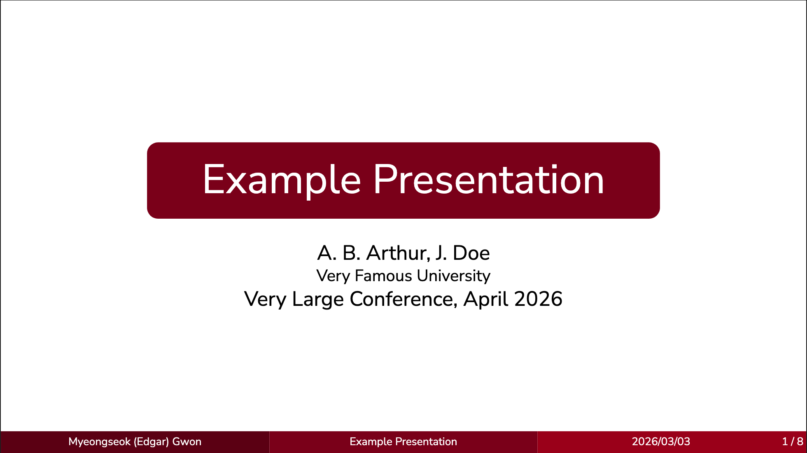
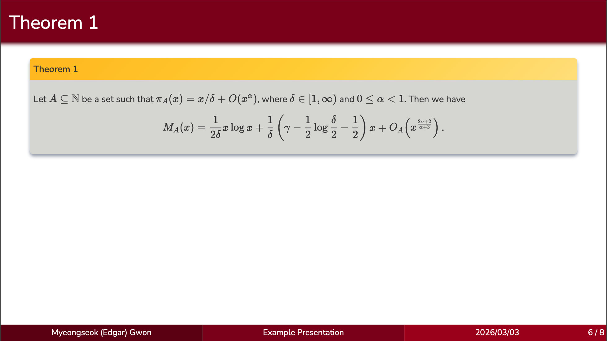

# slidev-theme-umn

[](https://www.npmjs.com/package/slidev-theme-umn)

A theme for [Slidev](https://github.com/slidevjs/slidev),
inspired by University of Minnesota branding (maroon and gold),
well-suited for academic talks.



## Install

Add the following frontmatter to your `slides.md`.
Start Slidev and then it will prompt you to install the theme automatically.

```yaml
---
theme: umn
infoLine: true # on by default, can be turned off
author: 'Your name here' # shows in infoLine
title: 'Title' # shows in infoLine
date: '2023/01/01' # shows in infoLine, defaults to the current date
---
```

Learn more about [how to use a theme](https://sli.dev/guide/theme-addon#use-theme).

## Components

This theme provides the following component:

```html
<Item title="Title of your thing">
	Create a box for definitions, lemmas, theorems, etc.
</Item>
```



## Contributing

- `npm install` (or `pnpm install`)
- Run `slidev your-slides.md` to start theme preview (or `pnpm dev -- your-slides.md`)
- Edit your slides and styles to see the changes
- `slidev build your-slides.md` to build
- `slidev export your-slides.md` to generate the PDF
- `slidev export your-slides.md --per-slide --format png --output screenshots` for PNGs
